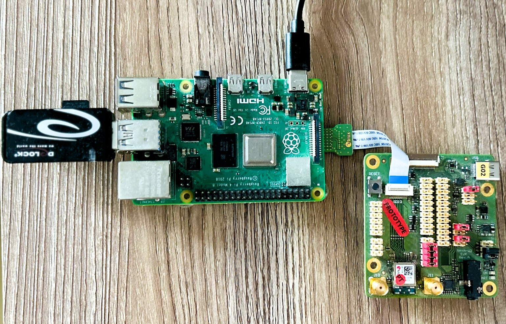

# Building host--based modules driver for Raspberry Pi 4 using NXP Open-Source Repository

This README file provides instructions on building and deploying firmware and drivers for various NXP chipsets on a Raspberry Pi 4.

## Supported u-blox Modules and Chipsets

| NXP Chipset     | u-blox Module | Wi-Fi Standard | Bluetooth Standard | Host Interface |
| --------------- | ------------- | -------------- | ------------------ | -------------- |
| 88W8801         | LILY-W1       | Wi-Fi 4 1x1    | -                  | SDIO           |
| 88W8987         | JODY-W2       | Wi-Fi 5 1x1    | Bluetooth 5        | SDIO, UART     |
| 88W9098         | JODY-W3       | Wi-Fi 6 2x2    | Bluetooth 5        | PCIe, SDIO, UART |
| IW416 (SD8978)  | MAYA-W1       | Wi-Fi 4 1x1    | Bluetooth 5        | SDIO, UART     |
| IW61x (SD9177)  | MAYA-W2       | Wi-Fi 6 1x1    | Bluetooth 5, 802.15.4 | SDIO, UART  |
| AW61x (SD9177) | JODY-W5    | Wi-Fi 6 1x1    | Bluetooth 5 | SDIO, UART  |


## Prerequisites

### Hardware
- Raspberry Pi (3/4/4b/5) host board. [Link](https://www.raspberrypi.com/products/)
- USB Flash Drive / SD card with USB SD card reader (32GB or more)
- u-blox module EVK kit 
- power cable USB -C type cable [Link](https://www.raspberrypi.com/products/)
- USB to TTL serial cable [Link](https://www.reichelt.de/de/de/raspberry-pi-usb-zu-ttl-0-9-m-pl2303hx-rpi-usb-ttl-p150567.html?PROVID=2788&gad_source=1&gclid=EAIaIQobChMI183FjY7-hgMVd5xQBh1dbg6uEAQYASABEgJBOPD_BwE&&r=1)

### Software
- Set up a Raspberry Pi with the latest image. 
- Set up a cross-toolchain 
  

## Downloading and Flashing the Raspberry Pi OS

1. **Download Raspberry Pi OS (64-bit):**
   - Go to the [Raspberry Pi website](https://www.raspberrypi.org/software/operating-systems/) and download the Raspberry Pi OS (64-bit) with desktop or Raspberry Pi OS Lite (64-bit) if you prefer a minimal version.

2. **Prepare the microSD Card/USB driver:**
   - Use a tool like [Raspberry Pi Imager](https://www.raspberrypi.org/software/) or [balenaEtcher](https://www.balena.io/etcher/) to write the Raspberry Pi OS image to your microSD card.

3. **Flashing the Image:**
   - Insert the microSD/USB drive card into your computer.
   - Open the Raspberry Pi Imager or balenaEtcher.
   - Select the Raspberry Pi OS image.
   - Choose the microSD card as the target.
   - Click "Write" and wait for the process to complete.

4. **Initial Setup:**
   - To enable the serial console, re-insert the prepared image microSD/USB drive open `bootfs` drive, and update the `config.txt` file by adding this parameter `enable_uart=1`
 ```bash
# For more options and information see
# http://rptl.io/configtxt
# Some settings may impact device functionality. See link above for details

# Uncomment some or all of these to enable the optional hardware interfaces
#dtparam=i2c_arm=on
#dtparam=i2s=on
#dtparam=spi=on

# Enable audio (loads snd_bcm2835)
dtparam=audio=on

# Additional overlays and parameters are documented
# /boot/firmware/overlays/README

# Automatically load overlays for detected cameras
camera_auto_detect=1

# Automatically load overlays for detected DSI displays
display_auto_detect=1

# Automatically load initramfs files, if found
auto_initramfs=1

# Enable DRM VC4 V3D driver
dtoverlay=vc4-kms-v3d
max_framebuffers=2

# Don't have the firmware create an initial video= setting in cmdline.txt.
# Use the kernel's default instead.
disable_fw_kms_setup=1

# Run in 64-bit mode
arm_64bit=1

# Disable compensation for displays with overscan
disable_overscan=1

# Run as fast as firmware / board allows
arm_boost=1

[cm4]
# Enable host mode on the 2711 built-in XHCI USB controller.
# This line should be removed if the legacy DWC2 controller is required
# (e.g. for USB device mode) or if USB support is not required.
otg_mode=1

enable_uart=1

[all]

```
   - Connect the UART pins on the Raspberry Pi to the USB TTL converter on the PC. Then, open [Tera Term](https://teratermproject.github.io/index-en.html) or any serial terminal tool using the COM port associated with the Raspberry Pi.
     
   - 

   - Insert the microSD/USB drive into Raspberry Pi 4's USB port  and power it on. ( See image)


   - connect the u-blox module over the SD card slot
     
   - 


## Setting Up the Development Environment

1. **Update and Upgrade:**
   Open a terminal and run the following commands:

     ```bash
     sudo apt update
     sudo apt upgrade -y
     ```

2. **Install Necessary Packages:**

   ```bash
   sudo apt install -y git build-essential bc libncurses5-dev bison flex libssl-dev
   ```

3. **Download Driver Sources:**

   ```bash
   git clone https://github.com/nxp-imx/mwifiex
   cd mwifiex/
   git checkout lf-6.1.1-1.0.0
   ```

## Building the Wi-Fi Driver

1. **Ensure the Chipset is Enabled:**
   - Check that the chipset for the u-blox module is enabled in the driver Makefile.
   - On non-NXP platforms, set `CONFIG_IMX_SUPPORT=n`.

2. **Build the Driver:**

   ```bash
   cd mxm_wifiex/wlan_src/
   export ARCH=arm64
   export CROSS_COMPILE=<cross-toolchain prefix> # e.g., aarch64-linux-gnu-
   export KERNELDIR=<path to kernel build dir>   # e.g., /usr/src/linux-headers-$(uname -r)
   make build
   ```

   - The build results will be located in `../bin_wlan/` and include `mlan.ko` and `moal.ko`.

   **Note:** `mlanutl` is not included since `lf-5.15.71-2.2.0`.

## Downloading Firmware

```bash
git clone https://github.com/NXP/imx-firmware.git
cd imx-firmware/nxp/
git checkout lf-6.1.1-1.0.0
```

## Deploying the Driver and Firmware to the Target System

1. **Copy the Driver Kernel Modules:**

   ```bash
   sudo cp mxm_wifiex/bin_wlan/mlan.ko /lib/modules/$(uname -r)/extra/
   sudo cp mxm_wifiex/bin_wlan/moal.ko /lib/modules/$(uname -r)/extra/
   sudo depmod
   ```

2. **Copy the Firmware Images:**

   ```bash
   sudo cp imx-firmware/nxp/<chipset>/* /lib/firmware/nxp/
   sudo cp imx-firmware/nxp/wifi_mod_para.conf /lib/firmware/nxp/
   ```

3. **Copy `mlanutl` Tool to the Target File System (if applicable):**

   ```bash
   sudo cp mlanutl /usr/bin/mlanutl
   ```

## Loading the Wi-Fi Driver

1. **Configure Wi-Fi Driver Parameters:**

   ```bash
   sudo modprobe moal mod_para=nxp/wifi_mod_para.conf
   sudo iw dev
   ```

## Loading the Bluetooth Driver

1. **Enable Bluetooth Kernel Configuration:**
   - Ensure `CONFIG_BT_HCIUART` and `CONFIG_BT_HCIUART_H4` are enabled in the kernel configuration.

2. **Load the Bluetooth Driver:**

   ```bash
   sudo modprobe hci_uart
   ```

3. **Attach UART Serial Device to Blue-Z Stack and Set Baud Rate:**

   ```bash
   sudo hciattach /dev/ttyUSB0 any 3000000 flow
   ```

## Verifying Network Devices

```bash
sudo iw dev
```

## Additional Information

For more detailed information, please refer to the official NXP and u-blox documentation.

---

This guide should help you build and deploy the firmware and drivers for NXP chipsets on a Raspberry Pi 4. Ensure all prerequisites are met and follow the steps carefully for a successful setup.
